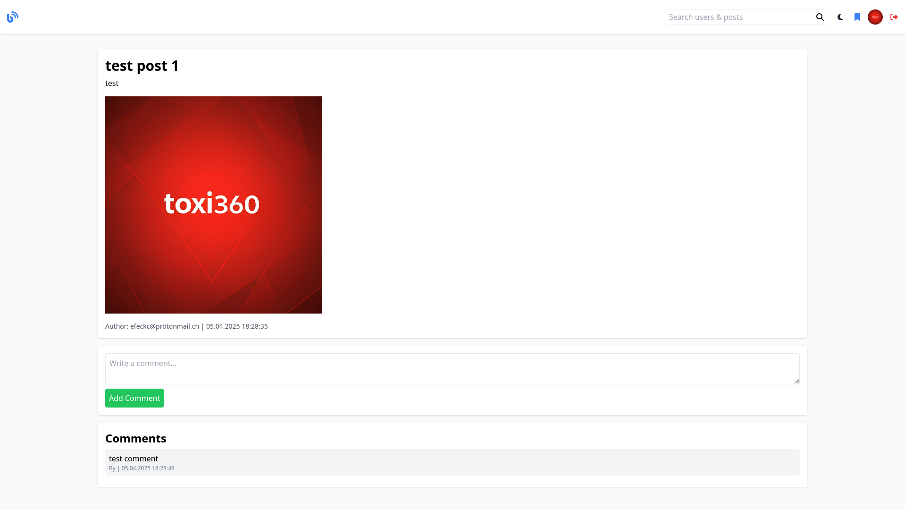
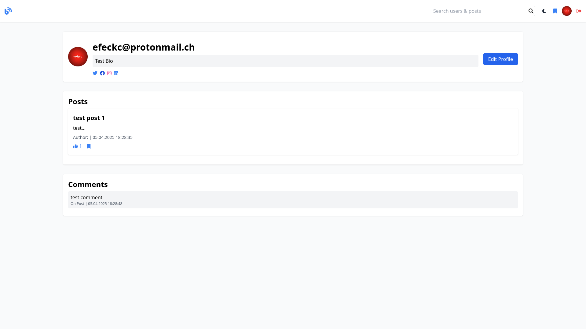
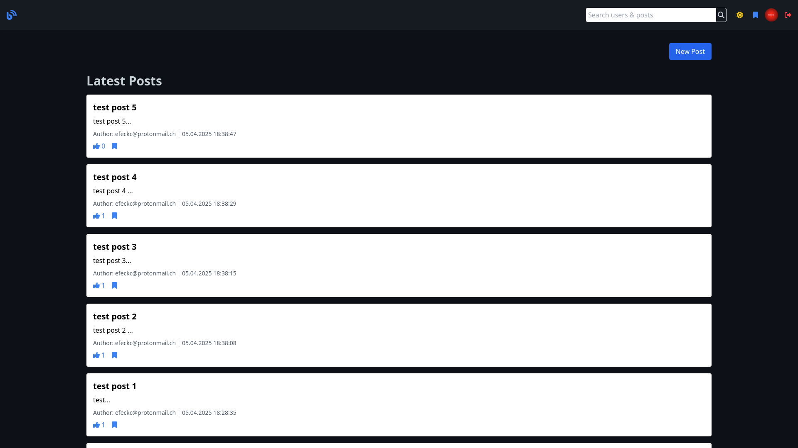

# 📰 Blog-Site


Blog-Site is a full-stack, production-ready blogging platform designed with modern aesthetics, robust security, and a rich feature set. It empowers users to share ideas, engage with content, and manage profiles — all within a smooth and responsive user interface.

---

## 🚀 Features

- **User Accounts**: Registration & JWT-based authentication
- **Profile Management**: Profile picture, bio, and social media links
- **Post System**: Create, edit, delete, like, and favorite posts
- **Commenting**: Comment on posts, delete own or (as admin) any comment
- **Favorites**: Save posts for later view
- **Popular Feed**: View top 3 trending posts by view count
- **Search**: Find users and posts via global search bar
- **Dark Mode**: Full theme toggle with local persistence
- **Admin Panel**: Manage users and content
  - Ban or permanently delete users (admin cannot be deleted)
  - Delete any post or comment

---

## 🛠 Tech Stack


### Backend
- Node.js + Express
- MongoDB + Mongoose
- JWT (Auth)
- Helmet, CORS, Rate Limiting

### Frontend
- React.js + Tailwind CSS
- React Router
- Axios
- Responsive & Dark Mode Ready

---

## 🛠️ Setup Instructions

### 1. Clone the repository
```bash
git clone https://github.com/Efeckc17/blog-site.git
cd blog-site
```

### 2. Environment variables
Create a `.env` file based on the template:
```bash
cp .env.example .env
```
Edit `.env`:
```env
PORT=5000
MONGO_URI=mongodb://localhost:27017/blogdb
JWT_SECRET=your_secret_key
ADMIN_EMAIL=admin@example.com
```

### 3. Start the Backend
```bash
cd blog-backend
npm install
node server.js
```

### 4. Start the Frontend
```bash
cd ../blog-frontend
npm install
npm start
```

---

## 🛡️ Admin Access
- Any user who registers with the email specified in `ADMIN_EMAIL` becomes an admin.
- Admins can access the `/admin` panel and manage all platform content.
- Admin accounts are protected from deletion.

---


## 📁 Project Structure
```
blog-project/
├── blog-backend/
│   ├── controllers/
│   ├── middleware/
│   ├── models/
│   ├── routes/
│   ├── utils/
│   └── server.js
│
├── blog-frontend/
│   ├── public/
│   └── src/
│       ├── components/
│       ├── pages/
│       └── App.js
│
├── .env.example
└── README.md
```

---

## 📷 Preview

### 📝 Posts and Comments
Users can create rich-text blog posts, comment on others' content, and engage through likes and favorites.

<br />

### 👤 User Profiles
Every user can customize their profile with a bio and add social media links.

<br />

### 🏠 Homepage Feed
Latest posts and trending content are shown on the homepage.


---

## 🤝 Contribution
We welcome contributions! Fork the repository, open issues, or submit pull requests.

---


## 🌐 Portfolio
Visit the creator's portfolio: [https://toxi360.org](https://toxi360.org)

---

## 📜 License
MIT License

